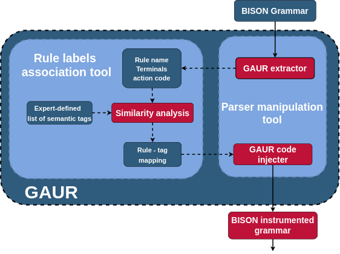

GAUR is a tool to integrate security-oriented data collectors in Bison generated parsers.  Given an input grammar file, it injects code to transparently produce a log with information characterizing parsed inputs. Specifically, using the [pygaur](./pygaur/) module, we statically associate semantic tags to each parser rule. At runtime, we produce a **semantic tree** caracterizing each application input. 
 
# Installation 
To be built, GAUR requires `gcc`, `make`, `flex` and `bison`. At runtime, the pipeline requires python packages (defined in [pygaur/requirements.txt](./pygaur/requirements.txt)). We provide a [shell.nix](./shell.nix) that creates an environement with all necessary dependencies.

After cloning this repository GAUR can be built using make:
```
$ git clone https://github.com/gquetel/gaur.git
$ make build
```
A gaur executable should be created within the current directory. 
``` 
$ ./gaur -h
Usage: gaur [options] -l file file 
Transform a yacc grammar into an intrumentalised one.
Options: 
-d,  --dot               Produce a dot file for the input grammar
-e,  --extract           Produce a file containing all of the grammar nonterminal
-h,  --help,             Display this help and exit
-i,  --inject=FILE       Path to the prologue code to inject
-l,  --list=FILE         Path to the nonterminals semantics list
-o,  --output=FILE       Leave output to FILE
-s,  --skeleton=FILE     Path to the skeleton file to use to produce by bison to produce the parser code

If the option -o is not used, the default output grammar filename is gaur.modified.y
```

# Running
The data collector added to the parser through GAUR innovation is to produce _semantic information_ characterizing the application inputs:  information about the impact of the input on the application the parser is part of. In this proof of concept, we infer an approximation of this impact by analyzing the lexical field used in the grammar file: nonterminal and terminal names, functions called, and variable names. 

We mostly focus on inferring the impact of queries inside DBMS. The behavior of each query in DBMS can be seen as an **action** performed on an **object**. Gaur is designed to automatically instrument parsers to provide log entries with this information for each parser input, and some other syntactical information (see [src/injects/README.md](src/injects/README.md) for more details about entries generated by the data collector). 

Directly inferring the action and object labels given the input is complex: alternate encoding and syntactic mutation prevent the usage of NLP techniques on the queries. Furthermore integrating a NLP inference module within the application would add a significant overhead. Therefore the association is performed in two steps: first, we infer an action and object label to each parser's rules. We claim that analyzing the code and lexical fields used in these rules allows us to infer the impact of queries parsed with said rules.  Then, at runtime, the data collector integrated within the parser retrieves each rule used to process an input and construct the semantic trace that will be post-processed to infer labels. 

<p align="center">
  
</p>

The instrumentation of a parser by GAUR is therefore divided into 3 steps: **rule data extraction**, **rule labels association (by `pygaur`)**, and **grammar instrumentation**. 

## Data extraction 

This first step aims to extract information (right now we focus on lexical information) from BISON grammars which will be fed to NLP mechanisms to associate labels to each rule. We currently extract left-hand side nonterminal names, right-hand side terminals, and attempt to extract any function call in the action code. The extraction output format is a comma-separated file where each line corresponds to a grammar rule. Rules are suffixed by a number that corresponds to the number of the extracted rule in its group of rules. Here is what is extracted for the update_stmt rule from the MySQL grammar: 
```
column_attribute.5,ON_SYM UPDATE_SYM , PT_on_update_column_attr
```

## Semantic similarity computation

We use the produced CSV file to compute semantic flags using `pygaur`. `pygaur` uses semantic similarity measures (through NLP techniques) on data that has been extracted by GAUR to output a `json` file that specifies which labels have been associated with each rule. Flags are output to allow multiple labels for a single rule (although we do not support this feature yet).

## Grammar instrumentalization

The output of the Python script is made to facilitate the parsing in the next phase. This next phase takes the labels inferred (in the form of flags by `pygaur`) and includes them in the parser code. This part involves two mechanisms: 
- Hijacking Bison to use a custom [skeleton](https://www.gnu.org/software/bison/manual/html_node/Decl-Summary.html#index-_0025skeleton) that places C macros at specific positions to store information about the input while parsing, and produce a log entry once parsing is done. 
- Defining the code of these macros. This is done in the `src/inject.*` files that are injected as a prologue in the instrumentalized grammar. Each inject file defines specific characteristics to be produced by the data collector. We also inject an array that maps rule numbers to their associated computed labels: `ggrulesem`.
- We define the following macros:          
  - `GAUR_PARSE_BEGIN` initializes variables needed by the data collector during the parsing (counters, identifiers,...)
  - `GAUR_SHIFT` is used to detect when parsing is done (token `YYSYMBOL_YYEOF` received by parser) which triggers log entry creation.
  - `GAUR_REDUCE` is triggered at every reduction. It allows us to collect information about the rules used by the parser to process the input. We save rule information in a chained list of `_node_pt` items.
  - `GAUR_ERROR` is called on parsing and memory exhaustion error. We also want to produce log entries for syntactically invalid inputs.
  - `GET_ACTION_TAG` is used to retrieve the action label of a rule given its number.
  - `GET_ASSET_TAG` is used to retrieve the object label of a rule given its number.


To inject the code, you need to provide the output of `pygaur` through the `--list` option. 
Some applications require a specific parser skeleton, and the option `--skeleton filepath` allows to associate the correct one.